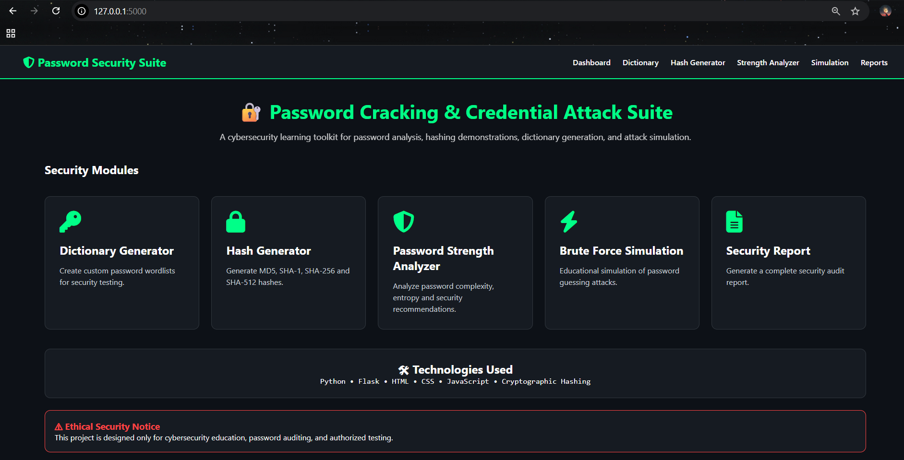
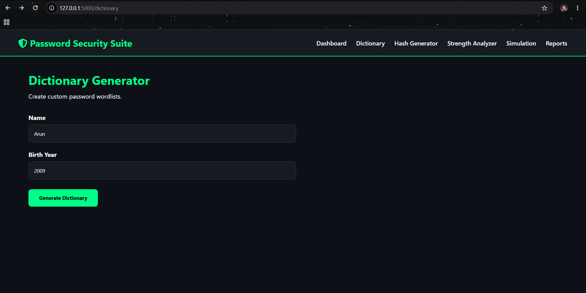
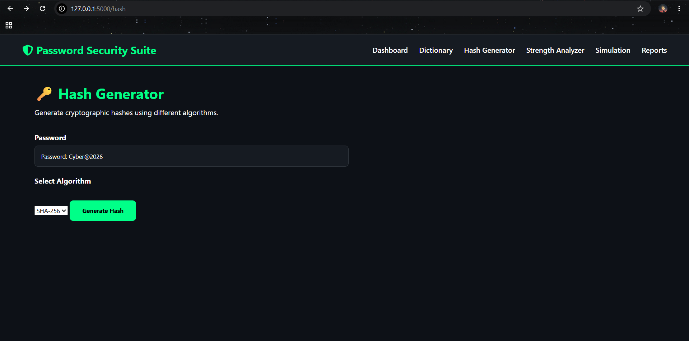
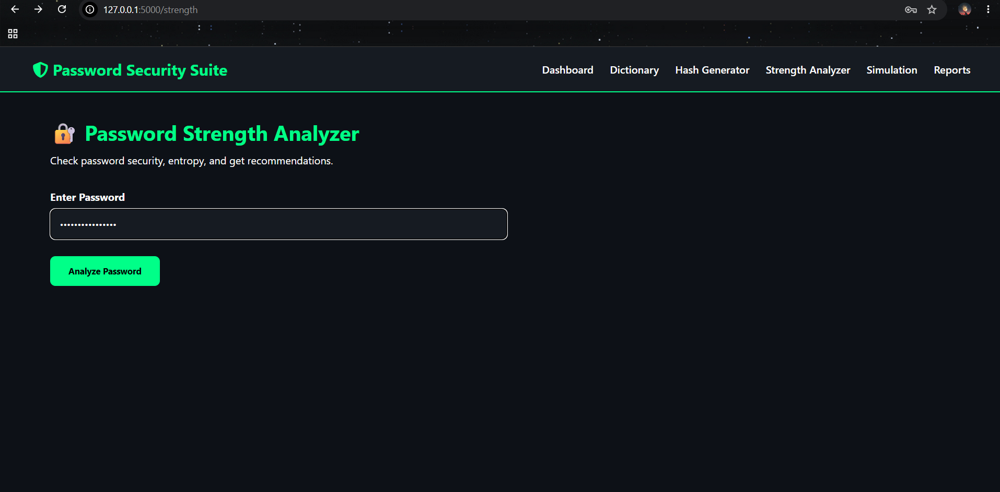
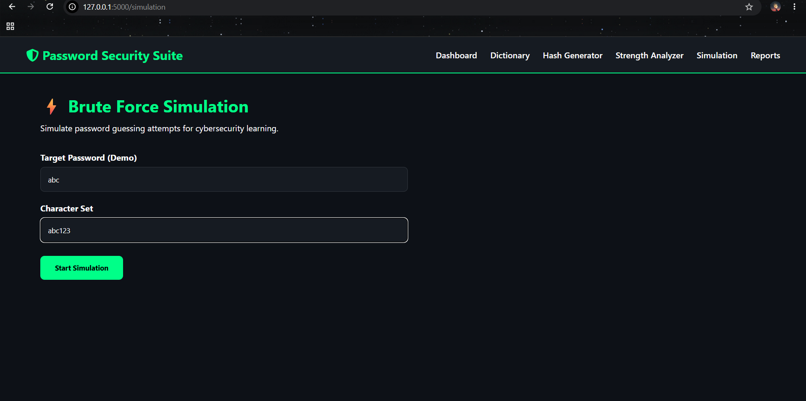
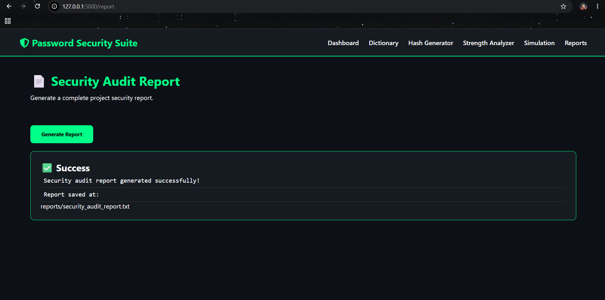

# 🔐 Password Cracking & Credential Attack Suite

A cybersecurity project built using **Python and Flask** to explore how password security works in real-world scenarios.

This toolkit combines multiple security concepts like password analysis, hashing, dictionary generation, brute-force simulation, and security reporting into one interactive web dashboard.

The main goal of this project is to understand password vulnerabilities and demonstrate how security tools analyze and evaluate password strength in a controlled environment.

⚠️ This project is developed strictly for **educational purposes and authorized security testing only**.

---

# 🌐 Live Demo

Try the application here:

https://password-cracking-credential-attack-suite-tcqd.onrender.com

# 🚀 Features

## 🔑 Custom Dictionary Generator

Create personalized password wordlists for security testing.

The generator creates password variations based on user inputs like:

- Names
- Years
- Numbers
- Special characters

Generated wordlists are automatically saved for further analysis.

---

## 🔒 Hash Generator

Explore how passwords are converted into cryptographic hashes.

Supported algorithms:

- MD5
- SHA-1
- SHA-256
- SHA-512

This module demonstrates the importance of secure password storage using hashing techniques.

---

## 🛡 Password Strength Analyzer

Analyze password security using multiple factors:

- Password length
- Uppercase and lowercase characters
- Numbers
- Special characters
- Common password detection
- Entropy calculation

The analyzer provides:

- Security score
- Password strength level
- Improvement recommendations

---

## ⚡ Brute Force Simulation

A controlled simulation demonstrating how password guessing attacks work.

The module calculates:

- Possible combinations
- Number of attempts
- Time taken
- Simulation results

This helps understand why strong and complex passwords are important.

---

## 📄 Security Report Generator

Generate a complete security audit report containing:

- Executed project modules
- Security recommendations
- Report generation time
- Project status

---

# 🖥 Interactive Web Dashboard

The project includes a Flask-based cybersecurity dashboard where users can access all modules from one place.

Features:

- Clean dark-themed interface
- Module-based navigation
- Interactive security tools
- Real-time analysis results

---

# 🛠 Technologies Used

- Python
- Flask
- HTML5
- CSS3
- JavaScript
- hashlib
- Regular Expressions
- Cryptography Concepts

---

# 📂 Project Structure

Password-Cracking
│
├── modules
│   ├── dictionary_generator.py
│   ├── hash_demo.py
│   ├── password_strength.py
│   ├── report_generator.py
│   └── simulation.py
│
├── templates
│
├── static
│
├── screenshots
│
├── reports
│
├── wordlists
│
├── app.py
├── requirements.txt
└── README.md
```

---

# ⚙️ Installation & Setup

1. Clone the repository:

```bash
git clone <repository-url>
```

2. Navigate to the project folder:

```bash
cd Password-Cracking
```

3. Install the required dependencies:

```bash
pip install -r requirements.txt
```

4. Run the Flask application:

```bash
python app.py
```

5. Open your browser and visit:

```text
http://127.0.0.1:5000/
```

---

# 📸 Screenshots

> Add screenshots after capturing them.

## Dashboard



## Dictionary Generator


(screenshots/dictionary2.png)

## Hash Generator


(screenshots/hash2.png)

## Password Strength Analyzer


(screenshots/strength2.png)

## Brute Force Simulation


(screenshots/simulation2.png)

## Security Report



---

# ⚠️ Ethical Disclaimer

This project has been developed for educational purposes and authorized cybersecurity testing only.

It is intended to demonstrate password security concepts such as hashing, password analysis, dictionary generation, and brute-force simulation in a safe and controlled environment.

Do not use this project against systems, accounts, or networks without explicit permission.

---

# 👩‍💻 Author

**Athira Sajeevan**

B.Sc. Information Technology Student | Cybersecurity Enthusiast